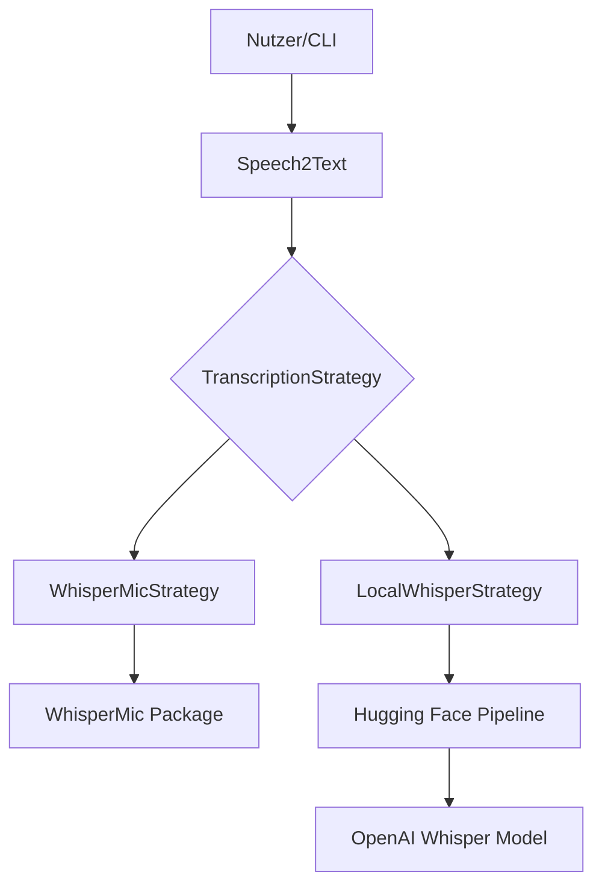
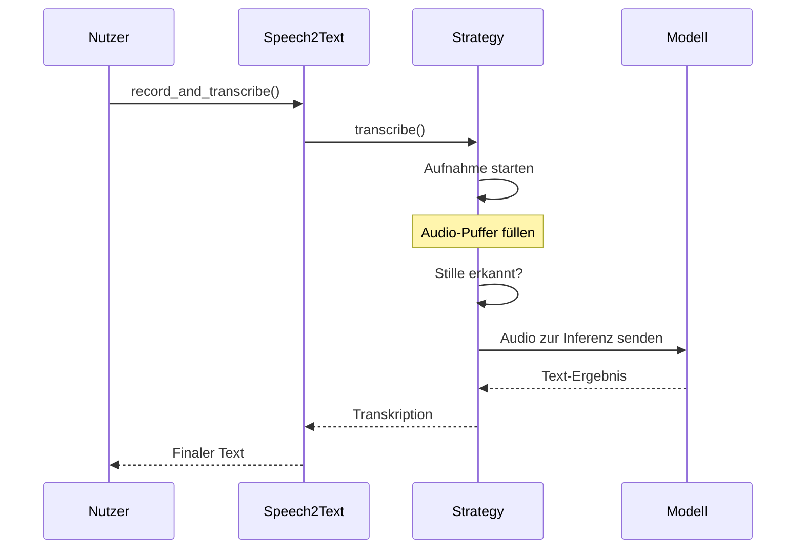

# Architektur

## Systemübersicht

`speech2text` nutzt das **Strategy Pattern**, um zwischen verschiedenen Transkriptions-Backends zu wechseln.

## Datenfluss

1.  **Initialisierung**: Das gewünschte Modell und die Strategie werden geladen.  
2.  **Aufnahme**: Audio wird vom Mikrofon gestreamt.  
3.  **Stille-Erkennung**: Das System analysiert die Amplitude und stoppt nach einer definierten Ruhezeit.  
4.  **Verarbeitung**: Die Audio-Daten werden an das Whisper-Modell gesendet.  
5.  **Ausgabe**: Der transkribierte Text wird zurückgegeben.  

