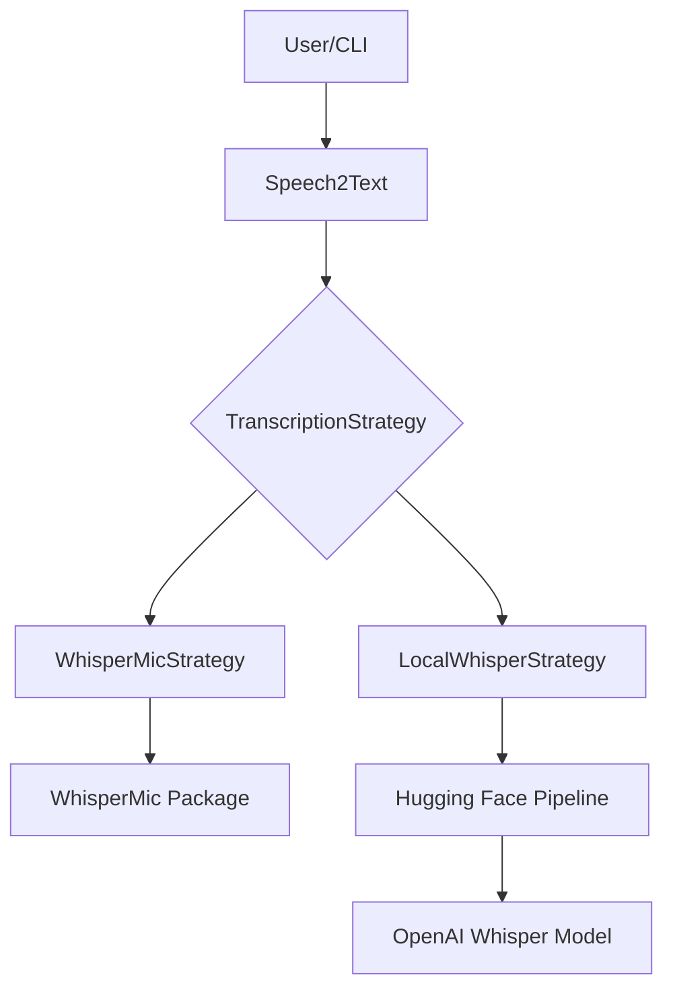
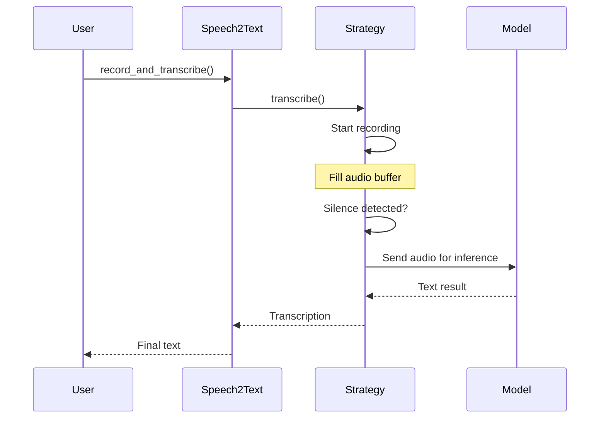

# Architecture

## System Overview

`speech2text` uses the **Strategy Pattern** to switch between different transcription backends.

## Data Flow

1.  **Initialization**: The desired model and strategy are loaded.  
2.  **Recording**: Audio is streamed from the microphone.  
3.  **Silence Detection**: The system analyzes the amplitude and stops after a defined period of silence.  
4.  **Processing**: The audio data is sent to the Whisper model.  
5.  **Output**: The transcribed text is returned.  

